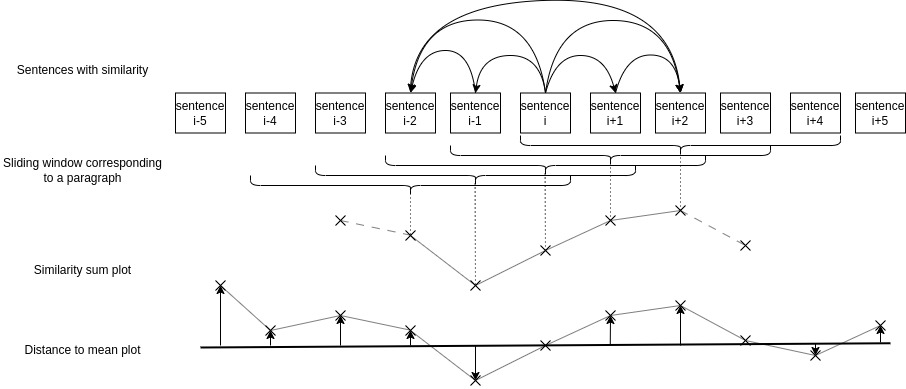

# Text Coherence Pipeline tool

A NLP tool for speech disorder detection, used in the scope of automatic text PTSD classification

## Introduction
See [this jupyter notebook](https://github.com/SB-ENSEA/text_coherence_pipeline/blob/main/example.ipynb) for a hands-on test of the tool on external data.
See [this jupyter notebook](https://github.com/SB-ENSEA/text_coherence_pipeline/blob/main/demo/demo.ipynb) for a complete test usage on the French 2017 presidential elections discourse corpus, showing the full pipeline from raw text file to extracting speech disorder samples.

Originally written for transcribed speech, the tool computes embeddings of sentences in the text and stores them in a similarity graph.  
Using this similarity graph, we estimate the impact of each sentence on the local coherence in the chosen paragraph, allowing us to extract examples of speech disorder.  

## Usage
### Installation
1) Create a virtual environment `python -m venv /path/to/env`
2) Activate the environment `source /path/to/env/bin/activate`
3) Clone the directory `git clone https://github.com/SB-ENSEA/text_coherence_pipeline.git`
4) Install dependencies `pip install -r requirements.txt`
### Use
With the file containing a dataframe with a text column. Each text in the corpus must be in a separate line:  

`python main_extract('file_path.csv')` or `python main_extract('file_path.pkl')`  
  
Resulting dataframe containing texts, all additional columns and graphs is stored according to the storage field of the [config](https://github.com/SB-ENSEA/text_coherence_pipeline/blob/main/config.yaml)
Using this pickle file, run :  
  
`python main_verbatim('file_with_graph_path.pkl')`  
  
Extracting specific examples of speech disorder along with a score, the sign of the distance, the z score computed by text, and the scaled score in a dictionnary.  
This dictionnary is stored in the storage_example field of the config

## Computation 
This method is based on a previous work, where it was shown that statistics extracted from the sliding paragraph-sized windows of sentences were powerful PTSD classifier. 
We have adapted these general, text-level statistics to extract specific examples of speech disorder on the paragraph level.  

The similarity model is the [paraphrase-multilingual-MiniLM-L12-v2](https://huggingface.co/sentence-transformers/paraphrase-multilingual-MiniLM-L12-v2) used in the [sentence_transformer](https://www.sbert.net/) python archive.  
We compute the impact of sentence i on the local similarity by using a local subgraph containing sentences between i-paragraph_size, i+ paragraph_size. 
In this subgraph, we compute for each sentence the sum of similarities between the sentence i and all other.  
Thus we have a sequence of the impact of each sentence on the local similarity.  

Using $w_{i,j}$ as the weight between sentences i and j,$S$ the sequence of similarities,$N$ the paragraph size, the following computations are made :  

$$s_i = \sum_{j = i-N, i \neq j}^{i+N} w_{i,j}$$
Then using $m$ as the mean coherence **on the whole text** :
$$S_i = s_i - m $$
We are able to extract data from this sequence, which will be the examples and their label : 
- **The score of the example**, i.e. the distance between the impact on the local coherence, and the global mean of similarity
- **The mode**, i.e. whether the example was extracted by taking a minimum or maximum of $S$, or whether it was taken with the lowest possible distance ('normal' mode)
- **Text mean distance**,the mean of $\lvert S \rvert$
- **Z-score**, the score of the example expressed as a product of the standard deviation of local coherence
- **Scaled score**, the score of the example divided by $m$

**Important Disclaimer** : This method was made to get precise verbatim from transcribed speech, with the scope of speech disorders and PTSD. Thus there is no guarantee that this method works on written text, on non-PTSD issued speech, etc... 
However, here are some effects to look out for if you use this tool as a text-level speech disorder indicator:
- **The value of $\lvert S \rvert$**, shows how much the narrative flow is impacted by each sentence, revealing effects of [clanging](#clanging) and [derailment](#derailment)
- **The scores of examples**, maximum and minimum values are often at a relative score between 4 and 10, normal examples are often between 0 and 2. An overlap between the scores of these modes in indicative of speech disorganisation
- **The Value of m**, the mean coherence is especially good at separating between written text and transcribed speech, according to our testing

## Speech disorders
Our speech disorder definition are taken from [andreasen et al. 1979](https://doi.org/10.1001/archpsyc.1979.01780120045006)
Considering our model is based on sentence similarity, we consider only the speech disorders that can be analysed from the paragraph level; without entering lexical data. 
This leaves us with the four following effects : **Clanging** , **Derailment**, **Incoherence**, **Illogicality**. Another speech disorder that we could consider is tangeantiality, however it supposes that there is questions and answers in the text

### Clanging
> A pattern of speech in which sounds rather
than meaningful relationships appear to govern word
choice, so that the intelligibility of the speech is impaired
and redundant words are introduced. In addition to rhym¬
ing relationships, this pattern of speech may also include
punning associations, so that a word similar in sound
brings in a new thought.

In our study, we associated Clanging and Perseveration (repetition of words and ideas) to underline repetition at any level, whether narrative, lexical or syntaxic. Clanging can be found in examples of the "maximum" mode, where sentences are very similar to others, on account of the repetitions they contain. 

### Derailment
>A pattern of spontaneous speech in which the ideas slip off the track onto another one that is clearly but obliquely related, or onto one that is completely unrelated. Things may be said in juxtaposition that lack a meaningful relationship, or the patient may shift idiosyncratically from one frame of reference to another. At times, there may be a vague connection between the ideas; at others, none will be apparent. This pattern of speech is often characterized as sounding "disjointed." Perhaps the commonest manifestation of this disorder is a slow, steady slippage, with no single derailment being particularly severe, so that the speaker gets farther and farther off the track with each derailment without showing any aware¬ ness that his reply no longer has any connection with the question that was asked.

Effects of Derailment are shown with examples of the 'minimum' mode. These examples show that removing the sentence from the induced subgraph actually increases the coherence of the paragraph, pointing to the idea that the sentence is a departure from the idea of the paragraph.  

### Incoherence
>A pattern of speech that is essentially
incomprehensible at times. The incoherence is due to
several different mechanisms, which may sometimes all
occur simultaneously. Sometimes the rules of grammar and
syntax are ignored, and a series of words or phrases seem
to be joined together arbitrarily and at random. Sometimes
portions of coherent sentences may be observed in the
midst of a sentence that is incoherent as a whole. Some¬
times the disturbance appears to be at a semantic level, so
that words are substituted in a phrase or sentence so that
the meaning seems to be distorted or destroyed; the word
choice may seem totally random or may appear to have
some oblique connection with the context.

Just like Derailment, Incoherence has a negative impact on the similarity of sentences, which is why removing the incoherent sentence increases the overall coherence of the text 

### Illogicality
>A pattern of speech in which conclusions are
reached that do not follow logically. This may take the
form of non sequiturs (ie, it does not follow), in which the
patient makes a logical inference between two clauses that
is unwarranted or illogical. It may take the form of faulty
inductive inferences.

We mostly include Illogicality as a way to underline non-sequiturs in our texts. Illogicality is shown by examples of the "minimum" mode.

